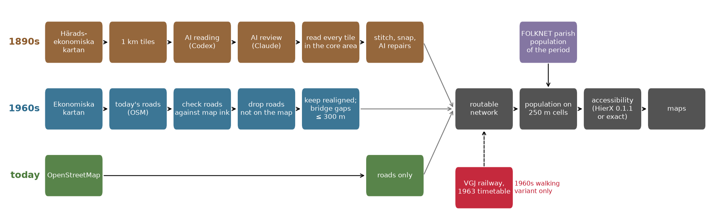
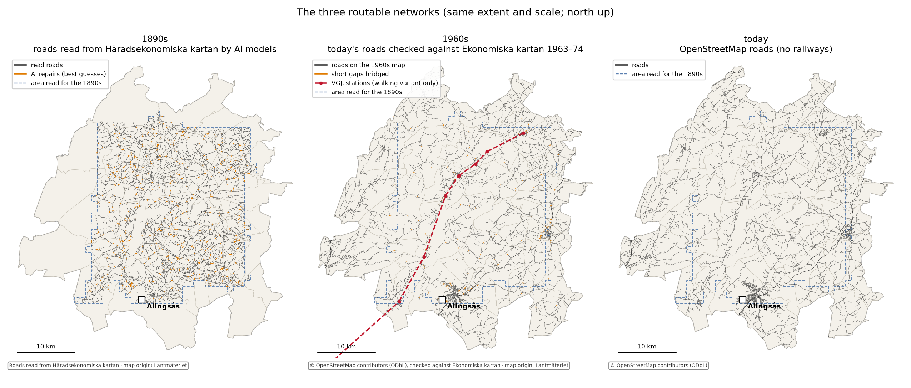
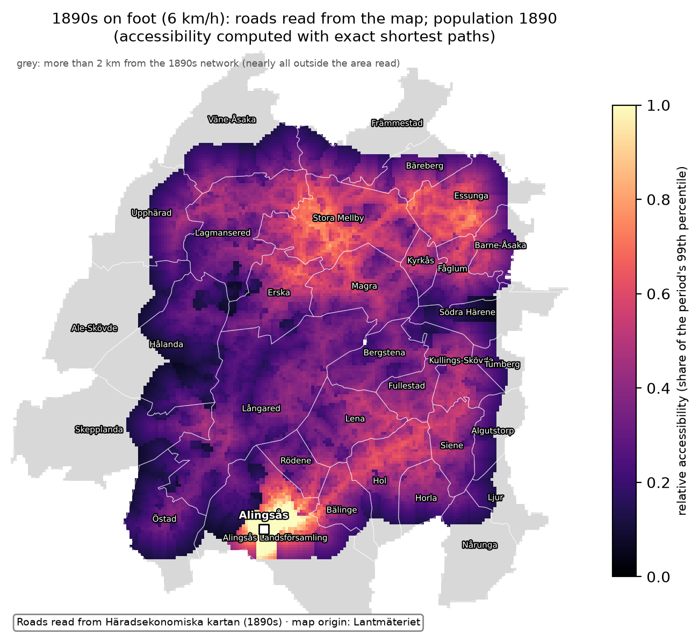
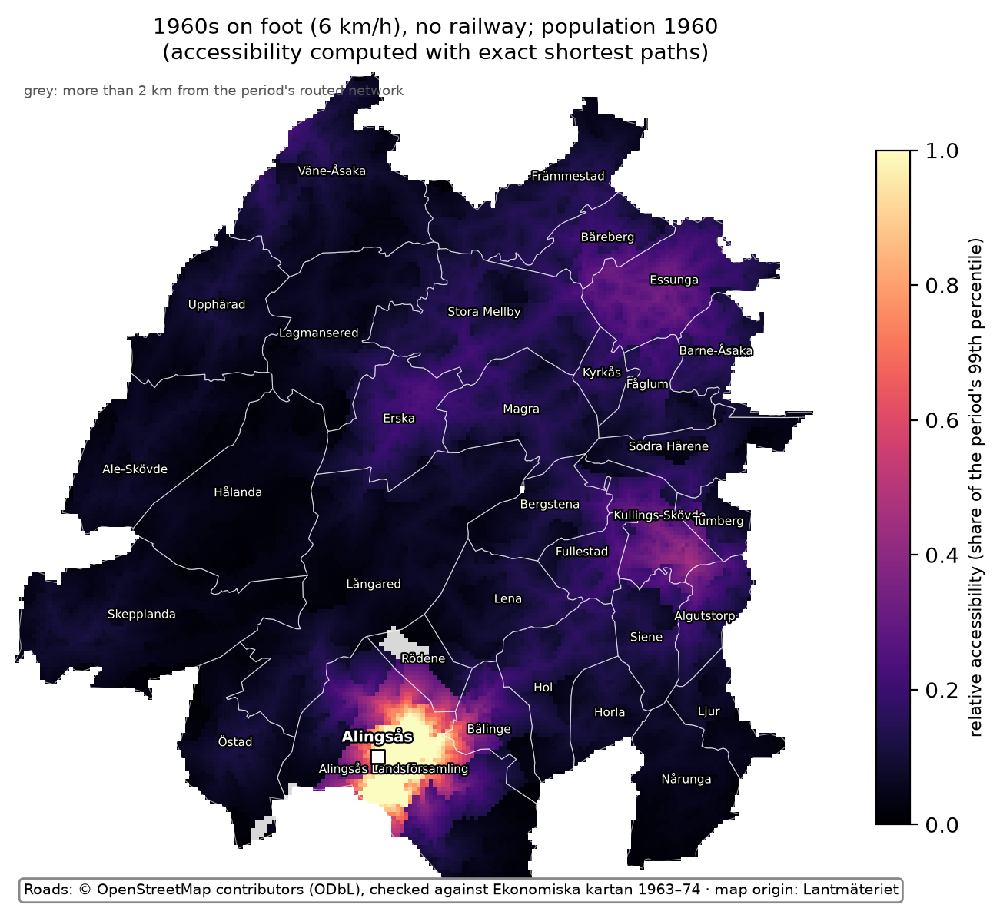
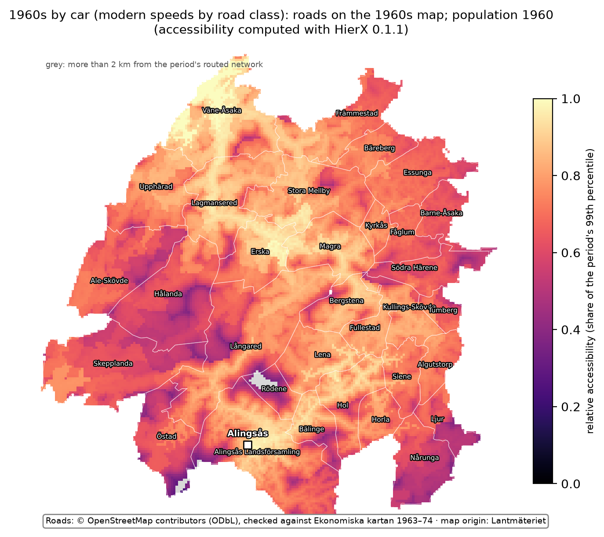
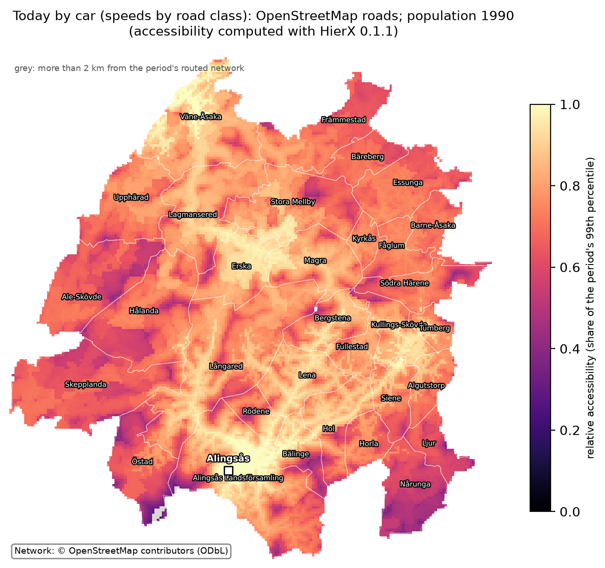
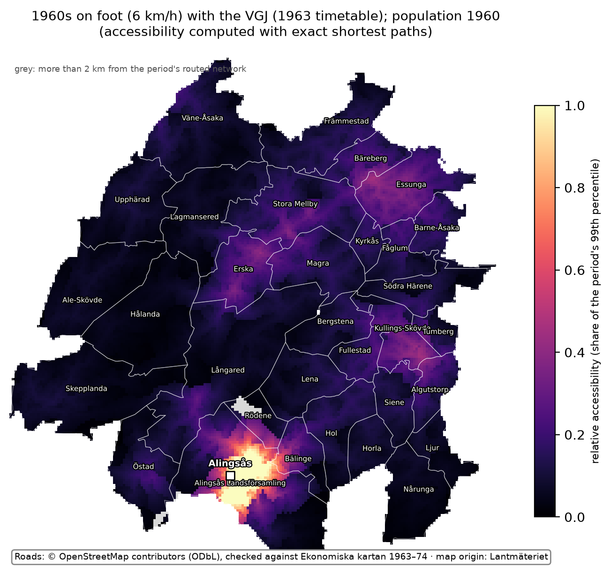
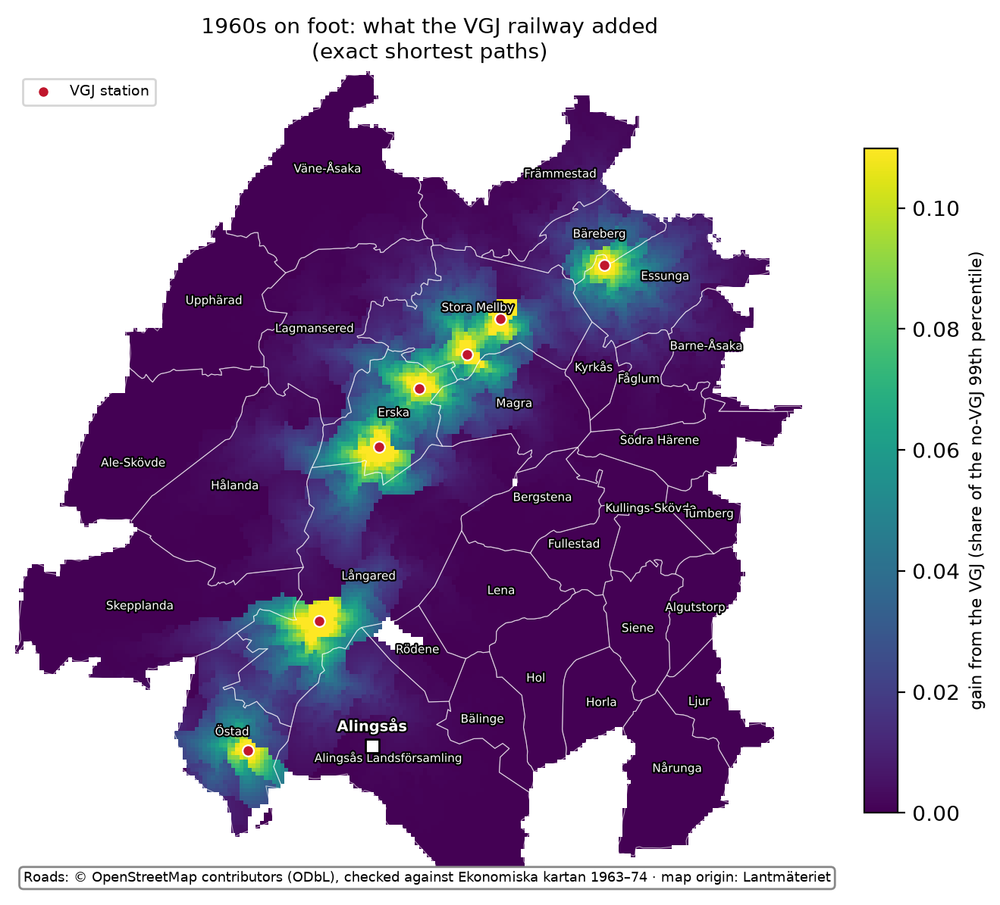

# Routable historical road networks from old map sheets: a feasibility demonstration

*Alexander Hellervik, Chalmers University of Technology. Version 1.0, October 2026.*

This is a pilot feasibility study. It is not a historical accessibility series, and it contains
no analysis of population response. It demonstrates, on one corridor in western Sweden, that a
routable road network can be read from 19th-century map sheets by AI models at bounded cost, that
it can be stitched and repaired into a graph, and that population can be wired in to produce
accessibility surfaces for different periods.

The corridor is the former Västergötland–Göteborg railway (VGJ) between Sjövik, Anten, Gräfsnäs,
Sollebrunn and Nossebro, north of Alingsås and about 45 km north-east of Göteborg: 32 parishes,
1,472 km², within a box of about 48 × 50 km. For the 1890s, 816 km² at its centre were read.

**Key numbers**

- **AI reading of the 1890s map:** about 2 hours of unattended time per map sheet (≈ 110 km²);
  816 tiles of 1 km² read and reviewed.
- **Accuracy:** the best setup, which a national run would use, found on average 93–97 % of the
  road length on one checked tile, with 1–2 % false length (97 % and 2 % on Lantmäteriet's clean
  scan).
- **Human checking** of a machine-read tile: about 7 min per km² once practised.
- **Southern Sweden:** between about 36,000 and 116,000 tiles to read (section 3).
- **Coverage:** 22 % of the 1890 population in the mapped area lives outside the area read and is
  left out of the 1890s map.

## 1. What was built

- **Sources:**
  - Häradsekonomiska kartan: 1:20 000, surveyed 1890–97 in this area; Lantmäteriet sheets in
    georeferenced scans by Naturvårdsverket.
  - Ekonomiska kartan: 1:10 000, Lantmäteriet, 41 sheets of 1963–74.
  - FOLKNET: a database of Swedish parish and town population, 1810–1990.
  - Historical parish boundaries: Riksarkivet, via the histmaps package.
  - OpenStreetMap.
  - The 1963 timetable of the VGJ.
- **Reading:** each 1 km² map tile is read by OpenAI's Codex agent running the model
  gpt-6.1-sol, given the map legend and one worked example (a neighbouring tile traced by the
  author). Claude Opus 5.5 then reviews the reading and keeps, corrects, removes or adds lines.
- **Timetable:** the VGJ's 1963 running times were transcribed from scans of the printed
  timetable (*Sveriges Kommunikationer* 1963 nr 6, tables 161 and 161 a) by an AI agent. It read
  the scans cell by cell, with no OCR, in about 0.6 hours.
  - 368 cells: none unreadable, 7 of medium confidence.
  - Three whole trips were read a second time, and where the two tables repeat the same trains
    their times agree to the minute.
  - The transcription is in `data/timetable_1963/`.
- **Which tiles:** the plan was a search outward from main roads and towns that stops once every
  parish is connected. In this corridor the search was replaced by reading every tile in the core
  area (section 4).
- **1960s, without AI reading:** each of today's roads is checked against the ink of the 1960s
  economic map along it.
  - Roads with no ink are dropped.
  - Roads straightened since the 1960s are found by searching a wider band.
  - Short gaps (300 m or less) that would strand a kept road or force a long detour are bridged
    and labelled as assumed.
- **Network:** read lines are stitched across tile edges. Loose pieces and short missing links are
  connected by AI repair passes, each repair labelled as a best guess. The result is a routable
  graph.
- **Accessibility:**
  - Population is spread from parishes to 250 m cells in proportion to the road length in each
    cell.
  - For every cell, accessibility is `A_i = Σ_j P_j · exp(−t_ij / 30)`, where `P_j` is the
    population of cell `j` and `t_ij` the travel time in minutes from cell `i` to cell `j`. The
    same 30-minute decay is used on foot and by car.
  - The car maps are computed with HierX 0.1.1, an open-source program for fast approximate
    accessibility on large networks, and checked against exact shortest paths. The walking maps
    currently use exact shortest paths.
  - At national scale, exact shortest paths are not an option. HierX will be used for every map,
    with its settings tuned for the right balance between computation speed and accuracy.

## 2. Results

The three networks are built in different ways, which shapes what they show:

- **1890s:** only the area read has roads. Small tracks drawn on the 19th-century map make it look
  denser than the later networks.
- **1960s and today:** they share their geometry, because the 1960s network is today's network
  minus what is not on the 1960s map.

The maps below show relative accessibility on 250 m cells: each period's value divided by its own
99th percentile, with values above it shown as 1. Each period uses its own network, travel mode
and population year.

**Compare the maps by pattern, not by brightness.** Walking maps are darker than car maps because
fewer people are within reach on foot, not because they are worse.

On the 1890s map, grey is almost all area that was not read. The bright block at Alingsås is the
town's own population, which dominates what can be reached on foot nearby; its straight edges
follow the edge of the area read.

The fair comparison across time is on foot, at the same speed (6 km/h):

 

By car, the 1960s and today:

 

On both car maps the far northern tip is brightest. It lies next to Trollhättan, the second town
zone, just outside the mapped area.

The 1960s walking variant shows what the pipeline can do with a historical railway. The VGJ is
added with its 1963 timetable times and 10 minutes at each station used (boarding, alighting), and
the map is computed with and without it. The second map shows the difference.

 

**Travel time to Alingsås.** Minutes from the 250 m cell at each parish's centre point to the
Alingsås town zone, on the same networks as the maps. Every time includes the straight walk from
the cell to the nearest road (at most 2 km, at 5 km/h); for Rödene in the 1960s that walk is
1.9 km, 23 of its 30 car minutes. Rows are sorted by today's time.

| Parish | 1890s, on foot | 1960s, on foot | 1960s, on foot with the VGJ | 1960s, car | today, car |
|---|---:|---:|---:|---:|---:|
| Alingsås Landsförsamling | 24 | 32 | 32 | 6 | 6 |
| Bälinge | 90 | 86 | 86 | 13 | 13 |
| Lena | 185 | 219 | 219 | 22 | 14 |
| Hol | 138 | 144 | 144 | 24 | 15 |
| Östad | 323 | 202 | 185 | 18 | 18 |
| Siene | 203 | 200 | 200 | 19 | 19 |
| Kullings-Skövde | 281 | 289 | 289 | 30 | 19 |
| Bergstena | 263 | 258 | 258 | 25 | 19 |
| Horla | 220 | 177 | 177 | 20 | 20 |
| Långared | 171 | 191 | 191 | 22 | 22 |
| Tumberg | 320 | 334 | 334 | 35 | 23 |
| Ljur | 278 | 239 | 239 | 23 | 23 |
| Fullestad | 227 | 225 | 225 | 25 | 24 |
| Algutstorp | 262 | 257 | 257 | 29 | 24 |
| Södra Härene | 371 | 413 | 358 | 42 | 26 |
| Magra | 318 | 336 | 239 | 33 | 27 |
| Erska | 345 | 363 | 197 | 38 | 27 |
| Rödene | 108 | 90 | 90 | 30 | 28 |
| Barne-Åsaka | 460 | 428 | 291 | 44 | 28 |
| Fåglum | 401 | 406 | 290 | 40 | 29 |
| Skepplanda | – | 324 | 324 | 35 | 30 |
| Kyrkås | 359 | 374 | 278 | 37 | 31 |
| Nårunga | – | 257 | 257 | 32 | 32 |
| Essunga | 446 | 460 | 245 | 44 | 32 |
| Bäreberg | 452 | 486 | 236 | 47 | 36 |
| Lagmansered | 436 | 441 | 261 | 45 | 36 |
| Hålanda | 416 | 468 | 296 | 54 | 37 |
| Ale-Skövde | – | 456 | 379 | 46 | 37 |
| Stora Mellby | 394 | 430 | 226 | 48 | 42 |
| Främmestad | – | 519 | 287 | 51 | 42 |
| Väne-Åsaka | – | 561 | 381 | 51 | 43 |
| Upphärad | 507 | 552 | 372 | 55 | 46 |

How to read the table:

- **"–"** means the parish is outside the area read for the 1890s.
- **Walking times run to hours,** so the walking columns compare network shape rather than
  journeys anyone made.
- **1960s on foot is often slower than 1890s on foot.** The 1960s network starts from today's
  roads and so misses roads abandoned since then (section 5), while the 1890s network includes
  small tracks and guessed repairs. The difference measures the two methods, not historical
  change.
- **By car,** the 1960s times are 1.0–1.6 times today's (median 1.2).

## 3. Effort and scale

All model work ran on fixed-price subscriptions (Codex and Claude Code). The figures below are
time and tokens, not prices.

| Step | Measured in the pilot | Per sheet of Häradsekonomiska kartan (≈ 110 km², every tile read) |
|---|---|---|
| Reading, gpt-6.1-sol via Codex, with the legend and one worked example | 816 tiles: about 7.0 min (median 6.6) and 123,000 tokens per 1 km² tile, retries included | ≈ 13 h model time, ≈ 13.5 million tokens |
| Review, Claude Opus 5.5 | median 1.75 min per tile; 819 review runs (816 tiles, one check tile, two runs redone) | ≈ 3 h model time |
| Unattended wall-clock, 8–12 tiles read and reviewed in parallel | 402 tiles in 6.9 h, then 386 in 6.5 h (≈ 59 tiles per hour both times); the other 28 tiles in a short search in between | **≈ 2 hours** |
| Human check of a machine-read tile (mark each line road / not road, fix geometry, add missed roads) | 17 min for the first tile, of which about 10 min learning the tools and symbols; about 7 min per km² once practised (author's estimate) | ≈ 13 h for a full check; a sample check scales down from there |
| Human tracing from scratch, for comparison | 51 min for one tile, of which about 30 min setup; about 20 min per km² once practised (author's estimate) | ≈ 37 h |
| 1960s route: modern roads checked against the 1960s economic map | no model reading; seconds of computing per sheet; the author's audit of 251 items took 50 min (≈ 12 s per item) | — |
| Timetable: tables 161 and 161 a of the 1963 timetable, transcribed by an AI agent from the scans | 368 cells in ≈ 0.6 h agent time; ≈ 0.5 h of the author's time finding the source | — |
| Railway events: openings, closures and timetable changes of the VGJ, dated from four kinds of sources (not used in the maps) | 34 events in ≈ 0.7 h agent time and ≈ 2 h of the author's time | — |

**National scale (estimate).** Häradsekonomiska kartan covers about 116,000 km² of land in
southern Sweden on 1,447 sheets. A sheet spans about 110 km²; coastal sheets are partly sea, so
land averages about 80 km² per sheet.

- **Lower bound, about 36,000 tiles:** a search outward from main roads and towns that stops once
  every parish is connected. Simulated on today's roads, it reads about a third of the land. The
  simulation assumes a road read on one tile continues cleanly into the next.
- **Upper bound, about 116,000 tiles:** in this corridor that assumption failed. Readers often
  stop lines short of a tile's edge, so the corridor needed every core tile: 816 against 392
  simulated, about twice as many. A national run should be costed between the two figures.

| National totals (estimate) | 36,000 tiles | 116,000 tiles |
|---|---:|---:|
| Reading, model time | ≈ 4,200 h | ≈ 13,600 h |
| Unattended wall-clock at 59 tiles per hour | ≈ 610 h | ≈ 1,970 h |
| Tokens | ≈ 4.4 billion | ≈ 14 billion |
| Human check of 1 % of tiles, at 7 min per km² | ≈ 42 h | ≈ 135 h |
| Human check of 10 % of tiles | ≈ 420 h | ≈ 1,350 h |
| Human check of every tile | ≈ 4,200 h | ≈ 13,500 h |

The 1 % and 10 % shares are illustrations, not a sampling design. The share that is needed depends
on the accuracy required and on how well checking can be aimed at likely errors (section 6). All of
these steps can be run in parallel, which shortens the calendar time.

## 4. How good is it?

The aim is the end result, usable historical networks, not a benchmark of AI models. The method
for scaling up is the best configuration found: Lantmäteriet's clean scans, the series legend,
worked examples traced by a person, an AI reader and an AI reviewer, and human checking. More
human examples and continual tuning of the pipeline are part of the method.

Road reading is scored against one 1 km² tile, checked by the author starting from a machine
reading, at 15 m tolerance:

- **Completeness:** the share of the reference road length found within 15 m.
- **False-positive length:** the share of the read length with no reference road within 15 m.

| Setup | Completeness | False-positive length | Road-class agreement |
|---|---|---|---|
| Reader alone, best setup (means of 4 runs on each of two scans) | 0.97–0.99 | 0.14–0.15 | unstable, 0.43–0.92 |
| **Reader + review, best setup (means of 4 runs on each of two scans)** | **0.93–0.97** | **0.01–0.02** | unstable, 0.37–0.92 |
| Corridor production run, used for the maps (1 run) | 0.88 | 0.12 | 0.91 (one run) |
| 1960s route, author's audit of 209 segments on one sheet, scoring | 0.83 | 0.12 | 0.52 |
| 1960s route, same audit, network rule (roads judged present or uncertain kept) | 0.95 | 0.18 | — |

**The best setup is the one to scale up.** It is the reader followed by an AI reviewer, read four
times on each of two copies of the tile:

- **Lantmäteriet's clean scan:** on average 97 % of the reference road length found, with 2 %
  false length.
- **Naturvårdsverket's resampled copy:** 93 % found, with 1 % false length.

Single runs varied more (completeness 0.79–0.99). The review lowers completeness a little because
it removes some real roads along with most of the false ones.

The maps in section 2 come from an earlier production run, made before those improvements: 88 %
of the reference road length found, with 12 % false length. That run had two handicaps against
the best setup:

- It used Naturvårdsverket's georeferenced copies, which are resampled from the scans, because
  Lantmäteriet's clean scans had not yet been downloaded for the whole corridor.
- It used a review route chosen so that the run could proceed unattended.

**Limits of this measurement:**

- One tile and one reader: these are measurements of feasibility, not a validated accuracy.
- The reference tile was itself checked from a machine-read starting point, which may favour the
  pipeline.
- Road classes are not reliable and are not used for speeds.

The 1960s audit covered 251 items: 211 road segments on one sheet (209 usable, 2 marked
unsure), 20 segments from two late editions, and 20 questions about routes.

**What did not work first time** (kept in the record, not hidden):

- **The search rule.** The corridor search's first rule counted two tiles as connected when a line
  in either reached their shared edge. The network it produced was in hundreds of pieces, so every
  core tile was read instead: 816 tiles, 2,083 km of road lines.
- **Gaps.** An AI repair pass joined loose pieces where the map shows a road: 388 joins, 49 km,
  over eight passes. The main network grew from 1,442 km to 2,007 km, 93 % of the 2,159 km
  network of read lines, joins and repairs.
- **Detours.** The first 1890s walking times showed long detours inside the main network (Östad
  611 min to Alingsås, Långared 452). A second AI pass looked at every dead end that had another
  part of the network within 400 m but more than 2 km away by road: 884 cases, 329 joined
  (63 km). Those two times fell to 323 and 171 min.
- **Georeferencing.** The 1960s sheets, placed with the projection file that comes with them,
  were 160 m off. The standard coordinate-system code (EPSG) fixed it.

## 5. Limits

- **One corridor, one map series, one reference tile.** Times per sheet are extrapolated from 816
  tiles of one corridor. Accuracy is measured against a single 1 km² tile checked by the author,
  with one reader. These are feasibility measurements, not a validated accuracy.
- **Road classes are not used.** Class agreement is unstable between runs, so every 1890s road is
  given one walking speed (6 km/h). Ferries, seasonal roads and fords are not modelled.
- **Repairs are guesses, and gaps remain.**
  - AI passes join loose pieces and short missing links of the 1890s network where the map
    suggests a road: 717 joins, 112 km in a network of about 2,200 km.
  - Each join is labelled as a guess and kept in its own layer, so it can be removed or checked.
  - The second pass was added after the first maps showed detours.
  - Roads the reader missed entirely are not recovered by either pass.
- **Coverage.** Cells reach the network by a straight walk capped at 2 km. Cells farther away
  (grey on the maps) are left out: on the 1890s map, 22 % of the 1890 population in the mapped
  area, all but a handful of it outside the area read.
- **The 1960s network starts from today's roads.**
  - A modern road is kept if the 1960s economic map shows a road along it, or within 60 m for a
    road straightened since.
  - Short absent links (300 m or less) that would strand a kept road, or force a detour of more
    than 2 km, are kept and labelled as assumed (31 km in the corridor). These gap rules were
    added after the first 1960s maps showed long detours; the networks without them are kept for
    comparison.
  - A road that existed in the 1960s but is gone today cannot be found this way. Reading such
    pieces from the sheet, as for the 1890s, would close that gap.
  - The 1960s car map uses modern speeds by road class.
- **Population is spread, not located.**
  - Parish totals from FOLKNET are spread over 250 m cells in proportion to the road length in
    each cell. This is a modelling device, not settlement.
  - A falsely read road therefore also attracts population, so road errors count twice.
  - Towns whose parishes are merged in the population source are single zones.
  - "Today" uses the 1990 population, the latest year in FOLKNET.
- **Accessibility values are approximate on the car maps.**
  - HierX 0.1.1 is checked against exact shortest paths for every cell. The median relative error
    of the score is 4 % today and 4 % for the 1960s (95th percentile 13 %).
  - At walking speed the error is larger with the settings used here (median 10–11 %, 95th
    percentile 32–34 %), so the walking maps currently use exact values. At national scale HierX
    will be used throughout, with settings tuned for walking speeds as well.
  - Scores are relative to the 99th percentile of each map, so maps of different periods are
    compared by pattern, not by level.
- **Railways.** Only the VGJ is included, in the 1960s walking map, at its 1963 timetable times
  with 10 minutes at each station used. Main lines and modern railways are left out by design.
- **National scale is an estimate.** It is a range: the lower bound simulates a search on today's
  roads, and the corridor needed about twice the simulated number of tiles (section 3).
- **No inference.** The maps show what the pipeline produces. They are not a historical
  accessibility series and carry no analysis of population change.

## 6. Improvements to evaluate before scaling up

The pilot shows the pipeline works; it does not show it is the cheapest or best way to cover
southern Sweden. The ideas below were collected for testing before a national run. Each comes
with a small test that would decide whether to adopt it.

### Six to test first

Together they take one to two weeks of human and machine time. They decide
whether the national figure is nearer 36,000 or 116,000 tiles, and whether a sample check by a
person is enough.

1. **An independent reference set.** Every accuracy figure rests on one tile, itself checked from
   a machine reading.
   - Trace 12–15 tiles from scratch (about 5–13 hours), spread over sheets, terrain (forest,
     plains, coast) and survey years.
   - Report completeness and false-positive length per stratum, and the spread between tiles.
   - No other test on this list can be judged without it.
2. **Read every symbol, not only roads.** Ask a frontier model (or an image model) for a full
   reading of the map: roads, paths, boundaries, streams, ditches, field edges, railways, buildings
   and farms, water, names.
   - Every line drawn then gets a verdict. A boundary or a stream can no longer slip in as a road,
     which is where much of the false length comes from.
   - The result is a set of layers, not only a road network: buildings and farms give a place to
     put the population (instead of spreading it along roads, so road errors no longer count
     twice), and settlements and water give context for checks.
   - A model with common sense can also see where a road is going: a track that ends at a farm is
     a real dead end, not a gap to repair; one that stops short of a road it was heading for is a
     gap.
   - Test on 20 tiles: false-positive length and completeness of the road layer against the
     current reading; the share of dead ends explained by a farm or building; people per building
     against FOLKNET, which should be stable across parishes.
3. **Overlapping tiles and an edge rule.** Readers stopping lines short of a tile's edge doubled
   the tiles read (816 against 392) and caused most of the repairs.
   - Show the reader a 150–250 m margin of the neighbouring map, and require every road to be
     carried to the tile edge and its exit point listed.
   - Test on 60 tiles. If more than 90 % of roads meet a neighbour's exit within 15 m and repairs
     halve, the outward search becomes usable again, and that could halve the national cost.
4. **Human checking aimed by disagreement.** Checking every tile would take 4,200–13,500 hours.
   - Read each tile 2–3 times and keep lines found at least twice; this may cut false lines
     without the review's loss of real roads.
   - Send to a person only the tiles where runs disagree, the reviewer disagrees with the reader,
     or the network has suspicious dead ends and loose pieces.
   - On the reference tiles, adopt if at least 80 % of the error length falls in at most 25 % of
     tiles.
5. **One network with a lifespan for each road.** The 1960s route cannot see roads gone since,
   which is why 1960s walking times often exceed the 1890s ones.
   - Match the three periods into one network and record, for each road segment, the periods in
     which it is present.
   - For every 1890s road missing today, ask a yes/no question of the 1960s sheet: is there road
     ink here?
   - The author's audit ran at about 12 s per item. Test on the corridor with an audit of 100
     items, and measure the km recovered and the change in walking times.
6. **A small trained model.** Reading costs scale with every tile read.
   - Train an image-segmentation model (a U-Net) on the 816 reviewed tiles, run it over all
     tiles in hours on one GPU, and keep the AI reader for tiles where the model is unsure or
     disagrees with the modern roads.
   - Validate on the independent reference tiles. Adopt as a first pass if completeness is at
     least 0.90 and false-positive length at most 0.10.

### Other ideas worth a small test

| Area | Idea | Test |
|---|---|---|
| Reading | Classify roads in a separate pass: legend snippets along each traced line plus a measured ink width (single or double line) | 200 segments; adopt if class agreement is stable above 0.85, which would allow road-class speeds for the 1890s |
| Reading | Read whole sheets or 2 × 10 km strips at low resolution for the main roads, then tiles for detail | one sheet; completeness of main roads and detours |
| Reading | Lower resolution of Lantmäteriet's clean scans | 40 tiles at full, 0.75× and 0.5× resolution; if 0.75× loses under 2 points, tokens fall by about 40 % |
| Reading | A cheaper or open-weight reader, keeping the strong reviewer | 100 tiles; adopt if within 3 completeness points |
| Reading | Ask the reader to paint over the roads (a mask) instead of listing coordinates | 20 tiles; positional error at 5, 10 and 15 m |
| Reading | Ink thresholding and thinning first (the 1960s route already scores ink), AI only for ambiguous junctions and symbols | 20 tiles; share of the reference recovered by thresholding alone |
| Reading | Today's roads as a prior: the reader confirms or rejects known roads and traces only the rest | 50 tiles; adopt only if completeness on roads gone today does not drop |
| Checking | Network warning signs (dead ends, loose pieces, unmatched tile edges) as free quality signals | correlate with the reference scores |
| Checking | An 1890s line with no counterpart in the 1960s or today as a candidate false positive | false-positive rate inside and outside that group |
| Network | Join gaps only where the raster shows continuous ink, before any AI repair | corridor rerun; joins and scores against the AI passes |
| Network | Further map editions as yes/no presence checks to date roads: the 1930s economic sheets, and the 1:100 000 Generalstabskartan, which is too coarse in position to trace from and would be used only to check whether a road was present | one sheet |
| Accessibility | Check travel times against contemporary records: posting-station distance tables, 1960s bus timetables | 30 place pairs; median error under 10 % would be strong evidence |
| Accessibility | Slope from a terrain model, ferries with waiting time, once road classes are stable | corridor |
| Engineering | A job list and cache keyed on tile, prompt, model and examples, so no paid work is repeated | — |
| Engineering | Read the most populated tiles first, so any budget covers the most people | — |
| Engineering | Release each segment with its provenance (run, review action, repair label, agreement score) so users can drop guesses themselves | — |
| Approach | Invert the pipeline: read the sharper 1:10 000 1960s sheet as the base, and check the 1890s against it | one sheet; cost and accuracy against the current order |

## 7. Sources, licences and how to rerun

The repository `historical-networks-prestudy`
(<https://github.com/alexanderhellervik/historical-networks-prestudy>, archived on Zenodo) holds
the code, the instructions given to the models, and the derived data that may be shared:

- the models' answers;
- the 1890s road lines and repairs, read from Lantmäteriet maps;
- the 1960s scored road edges and the corridor's modern network, derived from OpenStreetMap.

**Licences:**

- **Repository:** code, this report and the author's derived data are under MIT;
  OpenStreetMap-derived files under ODbL 1.0 (© OpenStreetMap contributors); parish geometry
  under CC0.
- **Sources:**
  - Häradsekonomiska kartan is out of copyright: Lantmäteriet states that maps older than 70
    years may be published freely.
  - Ekonomiska kartan is Lantmäteriet open data under CC0.
  - Riksarkivet's historical boundaries (via histmaps) are CC0.
  - Population: Demografiska databasen, CEDAR, Umeå universitet (2022): Folkmängdsdatabasen,
    <https://dx.doi.org/10.17197/folknetdb_v01>.

No map sheet or scan is included, apart from the 1 km worked-example tile and two legend images given to the reading model; no FOLKNET population figure and no other raw source file is included.
`SOURCES.md` lists where to download each input, and `LICENSES.md` gives the terms for each
path. The terms were checked on 6 October 2026.

`make demo` rebuilds the networks, maps and travel times from the shipped data plus those
downloads. From a fresh copy it took 65 minutes on a 16-CPU machine and reproduced the numbers in
this report exactly.

## Use of AI

AI models are part of the method described here: Codex (gpt-6.1-sol) reads the 1890s map tiles
and Claude Opus 5.5 reviews the readings and makes the repairs, as set out in sections 1 and 4. AI
assistance (Claude Code, Anthropic) was also used to write the pipeline code, run the analyses,
and draft the text and figures of this report. The author directed the work, has reviewed the
report, and takes responsibility for its content.
